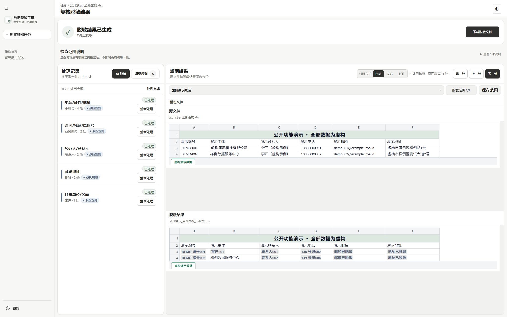
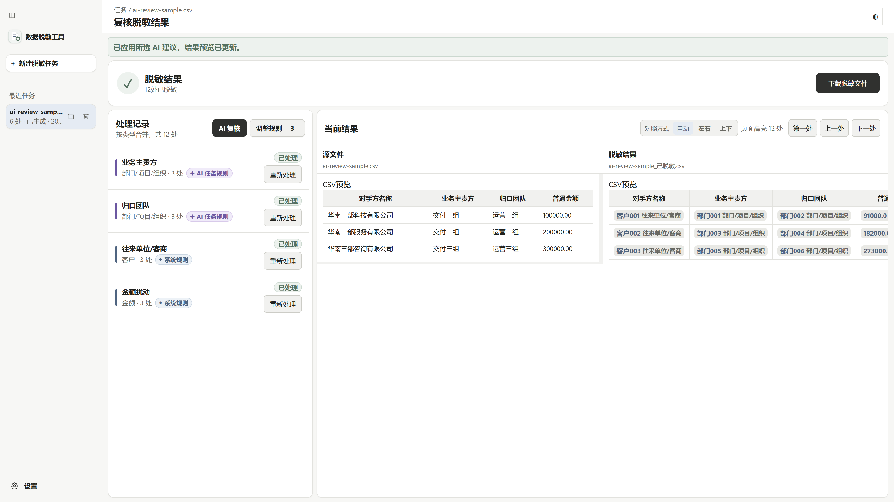
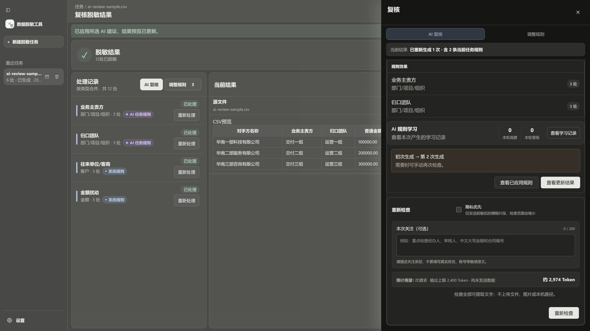
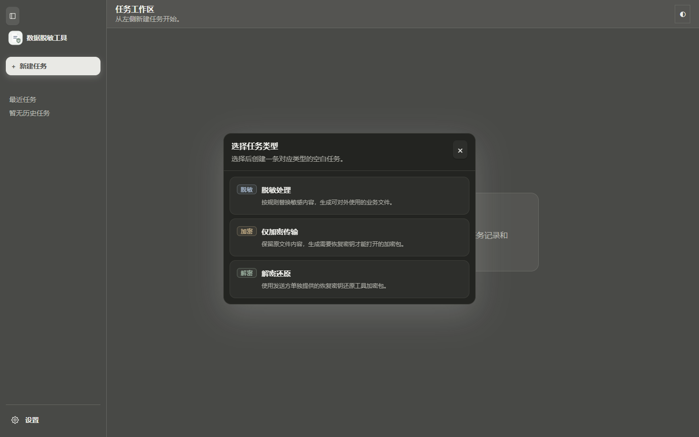

<div align="center">
  
  <h1>数据脱敏工具</h1>
  <p>面向办公文件共享、测试数据准备和业务复核的本地优先脱敏工具。</p>
</div>

> 这是由 [Brand1on](https://github.com/Brand1on) 维护的官方产品仓库。源代码不公开，Windows 便携版通过 [Releases](https://github.com/Brand1on/ai-desensitizer-showcase/releases) 发布。

## 功能演示



截图由程序处理专用文件 `公开演示_全部虚构.xlsx` 后生成。文件内容全部为虚构示例，不含用户文件、真实任务记录或业务数据。

### 结果复核



### 可选 AI 复核



AI 复核需要用户主动配置并确认。界面会说明发送范围、预计用量和当前状态。

### 加密传输



`v1.1.0` 增加仅加密传输和解密还原。发送方可以生成加密包，再通过其他渠道单独提供恢复密钥。

## 它解决什么问题

在文件离开原始环境前，识别并替换姓名、联系方式、证件信息、地址、账号等敏感内容，同时保留可复核的处理结果，降低文件共享和测试数据准备中的泄露风险。

## 使用流程

`导入文件 → 确认处理范围 → 本地脱敏 → 对照复核 → 导出结果`

## 当前能力

- 支持 `xls`、`xlsx`、`csv`、`txt`、`log`、`json`、`jsonl`、`sql`、`docx`、`pptx`、`pdf`。
- 默认在本机完成文件解析、规则匹配、替换和结果生成。
- 提供规则库和任务复核，便于发现误替换或遗漏。
- AI 能力为可选项，仅在用户主动配置并启用后参与处理。
- 支持生成加密传输包，并使用恢复密钥还原原文件。
- 历史任务、恢复密钥和 AI 配置跟随工具目录加密保存，复制整个目录即可迁移。
- 采用免安装的 Windows 文件夹方式交付，适合受限或离线环境。

## 下载

当前版本：**v1.1.0**，支持 Windows 10/11 x64。

[下载 v1.1.0 Windows 便携版](https://github.com/Brand1on/ai-desensitizer-showcase/releases/tag/v1.1.0)

下载 ZIP 后解压到普通文件夹，运行 `数据脱敏工具.exe`。程序不需要安装，Office 文件预览所需的 LibreOffice/PDF 运行时已包含在压缩包中。

SHA-256：

```text
B83C1A711A63FD0D92C1552A2A3AFAAD04E2F4B6944F88D7443CF16D469AF371
```

## 数据边界

- 默认本地处理，不要求上传原始文件。
- AI 功能不会在未启用时自动调用外部服务。
- 扫描件、图片内文字等内容不属于当前自动识别范围。
- 自动脱敏用于降低风险，重要文件仍建议由使用者进行最终复核。

## 项目状态

当前公开版本状态：**v1.1.0**

- 正式版覆盖脱敏、加密传输和解密还原三类任务。
- 历史任务以加密形式保存在工具目录内，可随便携目录迁移。
- Windows 便携包已完成构建、哈希校验和发布前检查。

版本变化见 [CHANGELOG.md](./CHANGELOG.md)。

## 作者与归属

独立设计与开发：[Brand1on](https://github.com/Brand1on)

Copyright © 2026 Brand1on. All rights reserved.

本仓库用于发布产品介绍、版本信息和官方 Windows 便携包。使用与版权边界见 [NOTICE.md](./NOTICE.md)。
